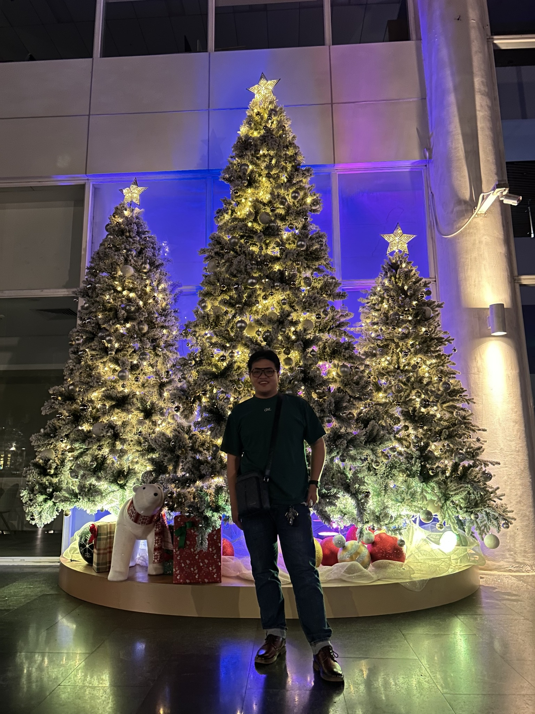
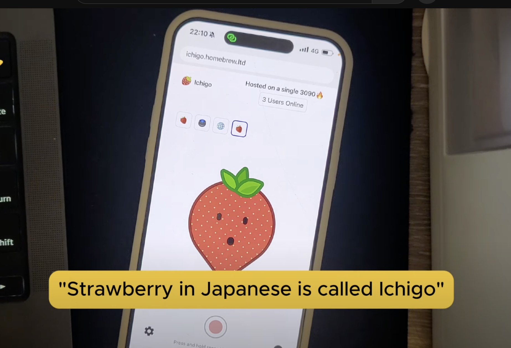
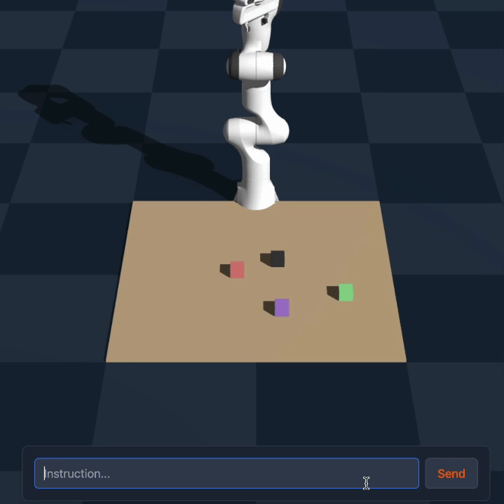
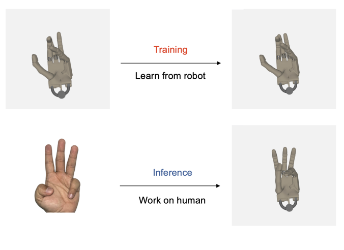
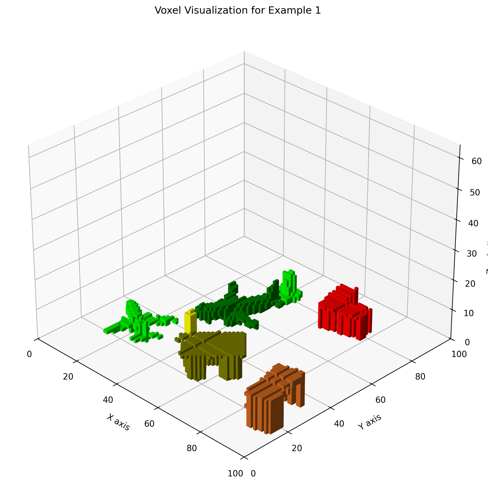

+++
title = "About"
description = "Who is me?"
date = "2024-04-27"
aliases = ["about-us", "about-hugo", "contact"]
author = "Alan"
enableComments = false
+++

## For work
- Email: contact@alandao.net
- Github: https://github.com/tikikun
- Twitter: https://x.com/alandao_ai
- Threads: https://www.threads.com/@alandaonet
- Facebook: https://www.facebook.com/alandaonet
## About me

Passionate AI Practitioner that wants to build things!

Some of the things I have built, contributed and invented with my dear friends and colleagues.

Things I have built!

## Ichigo
Jan-nano is a 4B model that can use tools + synthesize information using an agentic workflow for search and answering questions.

* https://huggingface.co/Menlo/Jan-nano

## Ichigo
Ichigo is a multimodal AI model that can handle speech natively with enhanced latency compared to traditional ASR to LLM solution. Find out more below

* https://github.com/janhq/ichigo
* https://arxiv.org/abs/2410.15316

## AlphaMaze
AlphaMaze is a novel two-stage training framework that equips LLMs with visual reasoning abilities for maze navigation using Supervised Fine-Tuning (SFT) and Group Relative Policy Optimization (GRPO).

Find out more:
* https://github.com/janhq/visual-thinker
* https://arxiv.org/abs/2502.14669

## AlphaSpace
AlphaSpace, developed by Menlo Research, is a framework that enables large language models to perform precise spatial reasoning for robotic manipulation in 3D space. Instead of relying on vision models, it uses a hierarchical tokenization method to represent spatial concepts directly in language. This allows LLMs to understand and execute tasks like picking, placing, or stacking objects in simulated environments. AlphaSpace significantly outperforms models like GPT-4o and Claude 3.5 Sonnet on such tasks, and a 1.5B parameter version is publicly available for testing.

Find out more:
* https://github.com/menloresearch/space-thinker
* https://arxiv.org/abs/2503.18769

## Poseless
PoseLess is a novel framework for robot hand control that maps 2D images to joint angles without explicit pose estimation, enabling zero-shot generalization and cross-morphology transfer.

Find out more:
* https://github.com/janhq/poseless
* https://arxiv.org/abs/2503.07111

## VoxRep
Comprehending 3D environments is vital for intelligent systems in domains like robotics and autonomous navigation. Voxel grids offer a structured representation of 3D space, but extracting high-level semantic meaning remains challenging. This paper proposes a novel approach utilizing a Vision-Language Model (VLM) to extract "voxel semantics"-object identity, color, and location-from voxel data. Critically, instead of employing complex 3D networks, our method processes the voxel space by systematically slicing it along a primary axis (e.g., the Z-axis, analogous to CT scan slices). These 2D slices are then formatted and sequentially fed into the image encoder of a standard VLM. The model learns to aggregate information across slices and correlate spatial patterns with semantic concepts provided by the language component. This slice-based strategy aims to leverage the power of pre-trained 2D VLMs for efficient 3D semantic understanding directly from voxel representations.
Find out more:

* https://github.com/menloresearch/voxel-representation
* https://arxiv.org/abs/2503.21214

## ReZero
Retrieval-Augmented Generation (RAG) improves Large Language Model (LLM) performance on knowledge-intensive tasks but depends heavily on initial search query quality. Current methods, often using Reinforcement Learning (RL), typically focus on query formulation or reasoning over results, without explicitly encouraging persistence after a failed search. We introduce ReZero (Retry-Zero), a novel RL framework that directly rewards the act of retrying a search query following an initial unsuccessful attempt. This incentivizes the LLM to explore alternative queries rather than prematurely halting. ReZero demonstrates significant improvement, achieving 46.88% accuracy compared to a 25% baseline. By rewarding persistence, ReZero enhances LLM robustness in complex information-seeking scenarios where initial queries may prove insufficient.

* https://github.com/menloresearch/ReZero
* https://arxiv.org/abs/2504.11001

## Jan
Jan is the most popular open source AI Chatbot Client with more than 1.5M downloads (and counting up)
* https://github.com/janhq/jan

## Nitro (Now is cortex)
Super light-weight inference engine for LLM models
* https://github.com/janhq/cortex (previously nitro - I invented this)
* https://github.com/janhq/nitro-tensorrt-llm

## Publication
I also wrote some papers! (More coming soon.) Check out my Google Scholar [here](https://scholar.google.com/citations?user=eGWws2UAAAAJ&hl=en).

- **Ichigo: Mixed-Modal Early-Fusion Realtime Voice Assistant**  
  [arXiv:2410.15316](https://arxiv.org/abs/2410.15316)

- **AlphaMaze: Enhancing Large Language Models' Spatial Intelligence via GRPO**  
  [arXiv:2502.14669](https://arxiv.org/abs/2502.14669)

- **PoseLess: Depth-Free Vision-to-Joint Control via Direct Image Mapping with VLM**  
  [arXiv:2503.07111](https://arxiv.org/abs/2503.07111)

- **AlphaSpace: Enabling Robotic Actions through Semantic Tokenization and Symbolic Reasoning**  
  [arXiv:2503.18769](https://arxiv.org/abs/2503.18769)

- **VoxRep: Enhancing 3D Spatial Understanding in 2D Vision-Language Models via Voxel Representation**
  [arXiv:2503.21214](https://arxiv.org/abs/2503.21214)

- **ReZero: Enhancing LLM search ability by trying one-more-time**  
  [arXiv:2504.11001](https://arxiv.org/abs/2504.11001)

- **Speechless: Speech Instruction Training Without Speech for Low Resource Languages** - This paper was accepted by INTERSPEECH 2025
  [arXiv:2505.17417](https://arxiv.org/abs/2505.17417)
---

I believe that in the next 10 years, everyone will have access to the most sophisticated and well-tailored education system that has ever existed, thanks to mass AI adoption.

**The future is bright! 🚀**
