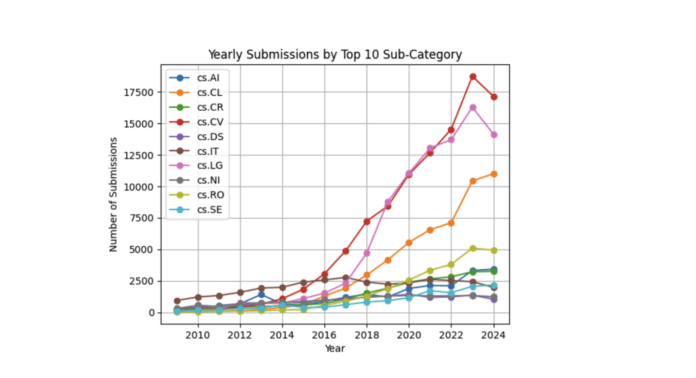
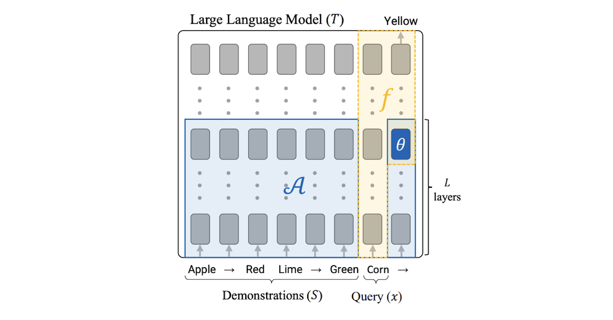
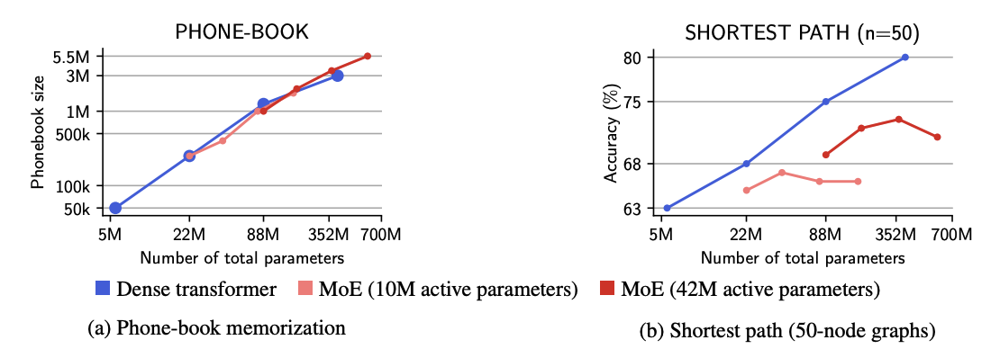
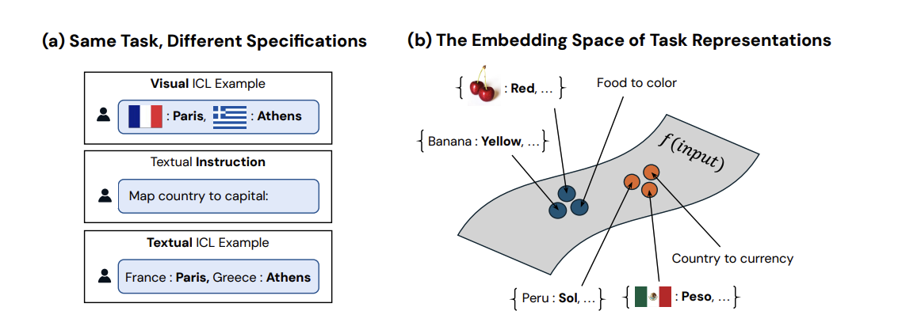
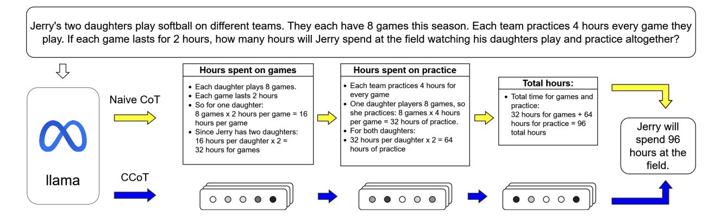

## 2024 the year of paper
In 2024, over 100 papers are published daily on arXiv, a staggering amount that's impossible to read all of. However, I've come across a few fascinating AI papers—some less mainstream but with solid ideas—grouped into three main categories of interest.
- Emergence compressive behavior
- Distribution matching
- Alternative

I will share what I learned by providing a short explanation (not just summary) of each paper, as well as give some of my general view on each category.

_Keep in mind, some of the paper inside the same category does not even cite each other. This only offers my own "point of view" since it is relevant to my research direction and interest_

## Overview of 2024 AI Papers: A Snapshot

2024 eyed a staggering amount of papers related to LLM (mostly transformer decoder), multimodality, generative AI, ... 

The day we first published (20 Oct 2024) [Ichigo](https://arxiv.org/abs/2410.15316), there are also ~700 papers published alongside us on the same day on in CnL (Computation and Language) category on arxiv.

Right now as of today in Dec, it is around ~1000 papers on a daily basis for CS category, most of which is AI/robotics related papers.

There are no lack of papers to read, so we might as well get started on these 10 papers, and 3 categories from mine.

---
##  Emergence Compressive Behavior

This category explores how the "internal states" or "hidden states" of large language models (LLMs) are inherently redundant and sparse. By leveraging the model's own ability—particularly the transformer decoder's capacity—we can generate a compressed version of these internal states for reusability. Essentially, this process mimics a form of compression within the model itself.

Below are the 4 papers I find quite interesting in this regard.

### 1. In-Context Learning Creates Task Vectors

Arxiv link: https://arxiv.org/abs/2310.15916

**Explanation:** This paper demonstrates that when you prompt a model to perform a task, the LLM (a transformer decoder, in this case) generates an internal state. Specifically, the final token of a query like "Apple -> Red, Lime -> Green, Corn ->" during inference creates a "task vector" at layer \( L \) in the forward pass. The task vector is an intermediate hidden state between decoder blocks. Remarkably, if you extract this task vector and perform inference on it in isolation—without including the prior context before "->"—the model can still generate outputs as if it had access to the full context window. For instance, in the example provided, the model can predict "Yellow" as the correct output without needing the full sequence.

### 2. Mixture of Parrots: Experts improve memorization more than reasoning

Arxiv link: https://arxiv.org/abs/2410.19034

**Explanation:** This paper explores the core strengths and weaknesses of Mixture-of-Experts (MoE) models. Few tests and benchmarks have been conducted, but the most prominent insight is that the number of **active parameters** is crucial to an LLM model's ability to perform reasoning tasks. The key result is shown in the chart above: with the same number of **total parameters**, MoE models can perform on par with dense LLM models in memorization tasks. However, MoE models with the same **total parameters** but fewer **active parameters** lag behind in terms of reasoning.

### 3. Task Vectors are Cross-Modal

**Explanation:** This paper follows up task vector paper with an interesting insight. In multimodal LLM model, the decoder will generate **nearly the same** task vectors when prompted with an **image instruction** compared to prompted with **normal text**. Hence, the task vector, or task function is a robust and universal way to describe task in decoder model. This has many implications for developing multimodal model. (And probably explain why [Ichigo](https://arxiv.org/abs/2410.15316) can convert so well with new sound tokens).

### 4. Compressed Chain of Thought: Efficient Reasoning Through Dense Representations

**Explanation:** This paper attempts to "compress" Chain-of-Thought (CoT) by selecting important hidden states of specific tokens rather than using the entire hidden states of all tokens during CoT generation. By doing so, they train a model to predict only the **important** hidden states within the CoT process and decode based solely on these, instead of the entire text-based CoT, which is inefficient. This approach achieves nearly the same performance as the full-text version.
