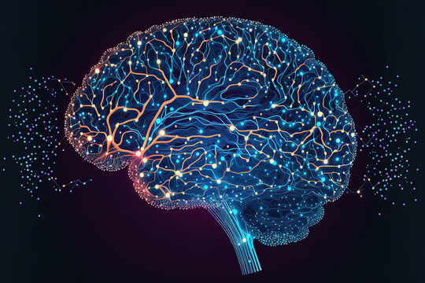
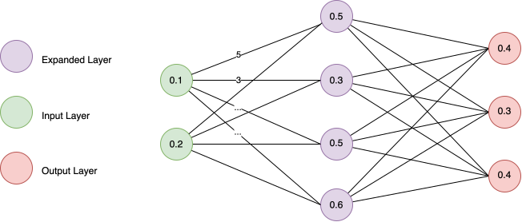
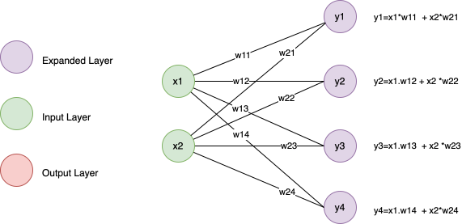

*Hello Neo here*

Ha! Got you there, not this matrix, the matrix I am talking about is this one.

$$
A = \begin{bmatrix}
a_{11} & a_{12} & \cdots & a_{1n} \\\
a_{21} & a_{22} & \cdots & a_{2n} \\\
\vdots & \vdots & \ddots & \vdots \\\
a_{m1} & a_{m2} & \cdots & a_{mn}
\end{bmatrix}
$$

Boring? But this is the fundamental thing that will connect you to "Neural Network" which is the building block of Artificial Intelligence and the like, surprisingly. I will show you how in the section below. But hey, hold on there! Let&#8217;s me tell what you the important thing first.

## What is Neural Network? 

First let's screw the complicated medical intuition, let&#8217;s just look at this cool image.

Welp, one thing you can conclude from this cool image is that maybe, just maybe, the brain is a complex structure of interconnected tissues or something. Okay, that is good enough, we will call it the **Neural Network**.

But how exactly this is relevant to matrix or like AI or anything at all ??? Just think about it.

The brain is the most complicated part of the species named **Human** which considers themself **sentient** and have extremely complicated behaviors thinking and invented, discovered quite complicated things like science, rocket,&#8230; and so on. So in fact, the brain posses something we call **intelligence**.

## What is Artificial Intelligence 

But thing is, human is quite hard to create, in fact you need almost 20 years of education for a baby to be productive and contributing to society on average. So, to overcome that we invented something called **Artificial Intelligence** which is in a nutshell, just trying to mimic the brain and intelligence to some degree.

But to do that we came up with a thing called **Neural Network** but, welp, the neural network in math does not contain meat and tissues.

## What is Neural Network again, but in Math 

Well you cannot bring tissues into math, obviously, but you can bring the concepts over! So let&#8217;s start with the basics:

  * You need it to be interconnected
  * You need it to carry informations (say a number or something)
  * You need information to change during the "connections" happening

And so something like this has been invented by AI researcher below.

Each of the small round node inside the chart is called a "cell" each cell is connected to each other by a line, on the line has some values (that will be multiplied by the value of the cell). The calculation process will go from left to right.

Also, you can see, it fulfilled the requirements above:

  * Cell is inter-connected with each other
  * Inside each cell it has a value (0.1, 0.2&#8230;etc)
  * Information is changed during the connecting step (You can see 0.1 is transformed into 0.5 because there is a value of 5 in the line connects the two cells)

So we have an probably "approximation" of the said &#8220;neurons&#8221; inside human brain, but in a mathematical way now.

## So what does it have to do with "The Matrix" 

### Forward Pass 

As can be seen from above during the "travel" (or **forward pass** per AI term) the value is changed based on the tiny number resides inside the thin line? so what is it? is there a formula or something and how does it look like, all of those can be summarized below.

So what we learnt from the chart and formula above? It looks neat and very organized, maybe it has some rules?

  * We have 2 input values : [x1,x2]
  * We have 4 output values [y1,y2,y3,y4]
  * The number of calculations need to be done must be equal to the number of output value (4 times y1,2,3,4= &#8230;)
  * The number of summarizations must match the number of input values (2 times, x1 multiply something and + x2 multiply something)

### The Matrix 

With the rule above, it will look weirdly similar, how exactly something looks so random and connected in a mesh together can have such clear rule (output, input, number of calculations etc&#8230; all known).

  * Can we have more generalized way to do the calculation for **neural network**
  * Can we not calculate node by node?
  * Can we parallelize it so that it&#8217;s calculated faster (right now it seems line by line)

In mathematics we have the exact thing just for that, down to every single line of calculation, it&#8217;s called **matrix theory (or matrix math)**. This blog is written for whoever already has some background in math at university/high school so I will just remind shortly.

  * If you have two matrices, A and B, where matrix A is of size **m x p** (where m is the number of rows and n is the number of columns), and matrix B is of size **p x n**,
  * The resulting matrix C, from the dot product A * B, will have the size **m x n**.

Look familiar ? In this case we can infer from the above chart and fill some information here?

  * A = \[x1,x2\] (the size is **1 x 2**)
  * C = \[y1, y2, y3, y4\] (the size is **1 x 4**)
  * Last one is the missing piece? B needs to be having the size of **p x n** (w11, w12&#8230;. and so on)

I have written out everything by that logic below.

First let&#8217;s declar vectors and matrix

$$
\text{Let } A = \begin{bmatrix} x_1 & x_2 \end{bmatrix},
$$
$$
B = \begin{bmatrix}
w_{11} & w_{12} & w_{13} & w_{14} \\\
w_{21} & w_{22} & w_{23} & w_{24}
\end{bmatrix},
$$
$$
C = \begin{bmatrix} y_1 & y_2 & y_3 & y_4 \end{bmatrix}
$$

Let&#8217;s do the Matrix Multiplication from matrix theory math!

$$
A \cdot B = C
$$

$$
\begin{bmatrix}
x_1 & x_2
\end{bmatrix}
\cdot
\begin{bmatrix}
w_{11} & w_{12} & w_{13} & w_{14} \\\
w_{21} & w_{22} & w_{23} & w_{24} \\\ 
\end{bmatrix}= \\\
\begin{bmatrix}
y_1 & y_2 & y_3 & y_4
\end{bmatrix}
$$

How can we populate value of C, of course through the use of calculations below

$$
\begin{aligned}
y_1 = x_1 \cdot w_{11} + x_2 \cdot w_{21} \\\
y_2 = x_1 \cdot w_{12} + x_2 \cdot w_{22} \\\
y_3 = x_1 \cdot w_{13} + x_2 \cdot w_{23} \\\
y_4 = x_1 \cdot w_{14} + x_2 \cdot w_{24}
\end{aligned}
$$

## Conclusion 

You have seen that the **forward pass** in **neural network** which is simply a process to pass a bunch of number into different **layers** and how it can be converted back to matrix math 100%.

Why this is important? Because nowadays all of the computations in AI, literally everything, is written in GPU, which is a hardware to do just one thing very, very well that is to do matrix multiplication (matmul). By converting all the issues in AI back to matrix math, we can, in fact develop AI much faster.

Due to above reasons, your matrix math became the pillar for AI and machine learning in general. In order to make AI faster, more efficient, we just need to figure out one single thing.

"How to to do matmul faster?"

