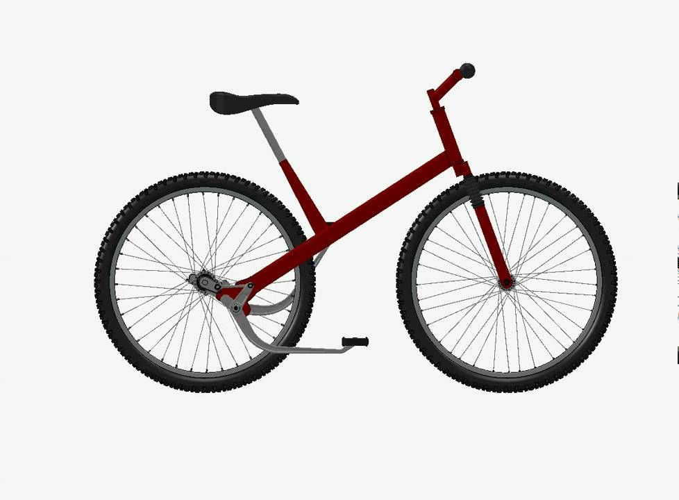
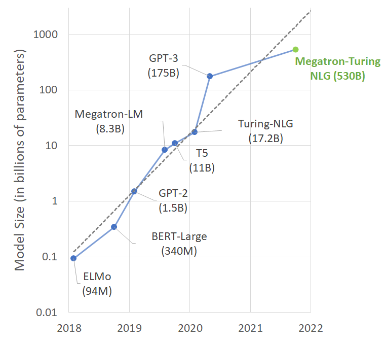

Today I went biking

and... I realize something I wanted. When I were biking 
- I weren't able to use the phone for navigation
- I were listening to music, but could not change tracks easily
- ...

I realize how much I need a hands-free solutions to control my phone in general while I riding a bicycle. My work is in AI, at this point I should have something just to parse my voice to just pick something I need, a better (yes) Siri or something like that? Guess what It is literally nowhere to be seen, something like that, for a cyclist!

In fact if we are reviewing some of the focuses of work in AI space right now, it will come as quite shocking that is it even driven by use case, do people even use, asides from obvious use case like chatGPT?

## Do things???

Seriously even though it seems broad and sophisticated, this makes zero sense.
- A phone is better at do "things"
- A phone has been finetuned, designed and catered for do "things" for > 10 years now
- A phone is snappier faster than your voice

You don't believe me yet? just look at this chainless bicycle

Some would say! amazing there is no chain, no chain maintainance, elegant no oils... but from a realistic perspective chain has been widely used and regarded as a standard and with extremely agile way to replace and repair for hundreds years. It is not needed, and redundant, to reinvent something working so well without issues for years.

Next time do something like this, go, buy a chainless bicycle first.

## Bigger models on bigger machine?

This has been done so many times before, NVIDIA showcased years ago how big it can get on their system to train an LLM model.

Asides from how amazing their system is and how high the bandwith and everything of their DC, this megatron model is not anywhere better than a llama3-8b as of today. This obviously will only lead to a richer hardware provider and might not provide any extra use-case since the model quality improvement is facing a diminishing return with scale.

Scale leads to quality improvement, and solidify the use-case of knowledge distillation, or simply, chatGPT. Going further with scale, however, does not seem to yield extra use cases.

## Faster?

We have machines that can produce throughput up to hundreds of tokens per seconds right now, and soon I think they will demo thousands of tokens per second. The latency is insane. You can literally have a piece of A4 worth of text in a blink of an eye.

Yes, it's a blob of text and that's the issue.

There was one guy on our discord one day he said "you know what my GPU went so fast and the models talk so much but it's nothing more than chunking out random sentence". At that moment it hit me, faster response time can help, but it will not provide use cases. In fact this year chatbot is just as much as last year, maybe it is a bit faster but the use case is the same, it does not become more helpful to me.

## Search alternative??

Perplexity, RAG, Langchain, LlamaIndex,... There are so many applications both open source and close source that is trying to replace Google.

I agree that Google's quality has declined recently, which has significantly contributed to my reduced usage of Google. But using alternative like Perplexity giving a feeling it is not anything different than Google itself.
- I need to read the search result anyways (sometimes the model is off)
- I thought AI supposed to give me answer, they just read out the answers somewhere
- Sometimes the queried results are horribly chunked

So it's basically search, with a talking engine, even more annoying. This does not seem to lead to any extra use cases for me.

## Recall??

How about taking all the pictures of your private computer just to see what you have seen?

How about that??

Nope

## Where is improvement of quality of life?

All the AIs all the token speed I cannot even stop my music while I am cycling around the city. The current focus in development will not yield better use case, in fact I'm very confused on what will it lead eventually.

ChatGPT has been working as an "knowledge distillation" very well, and that is probably the reason why it has such a good traction and users all over the globe. But, "ChatGPT harder" might not be a sustainable way to do AI developement.
