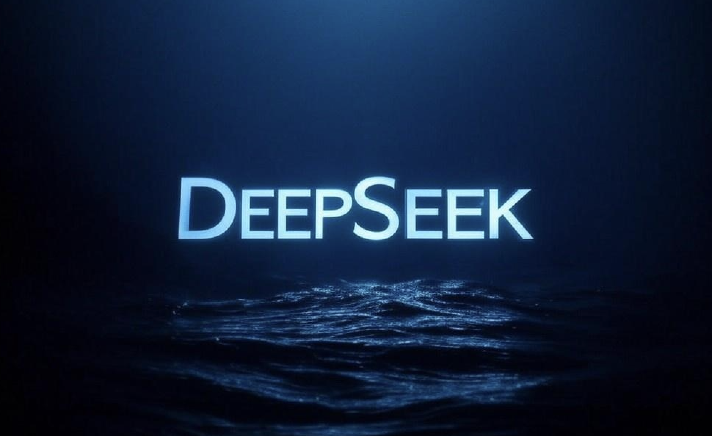
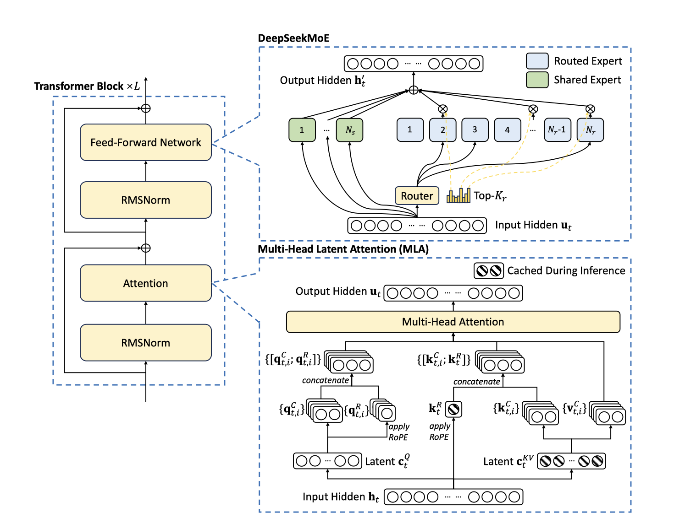
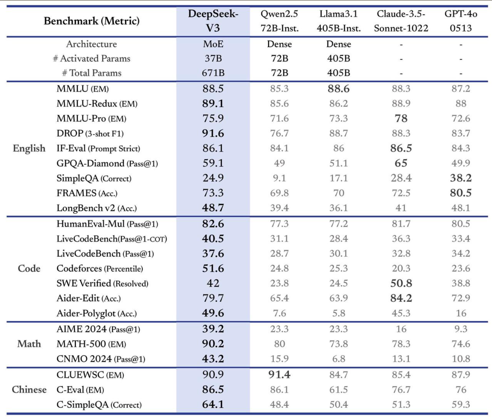
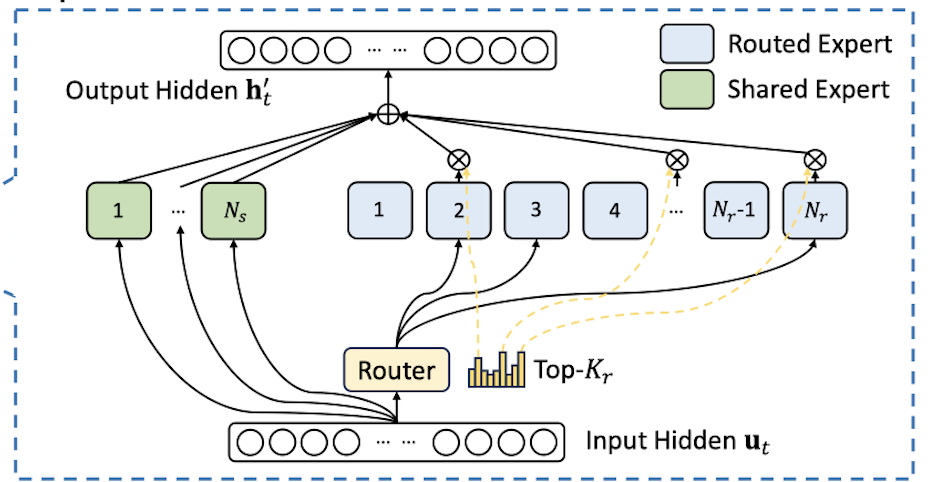
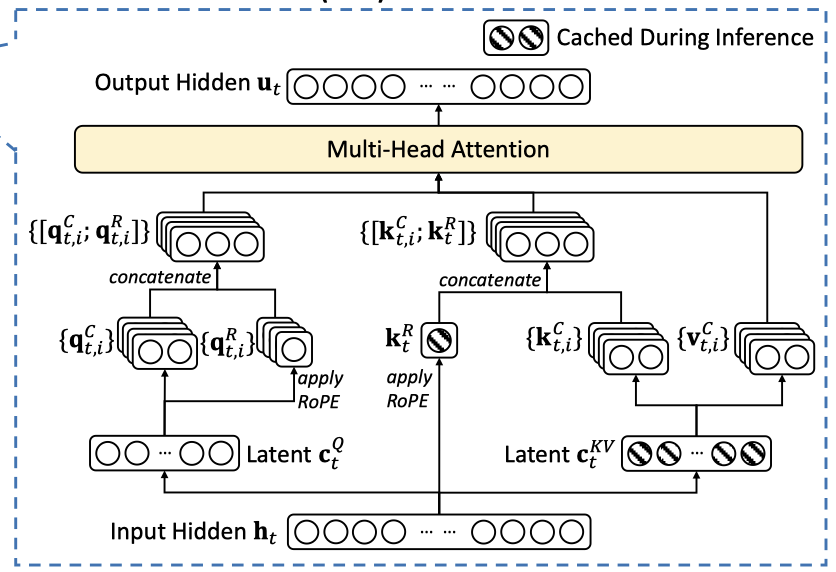
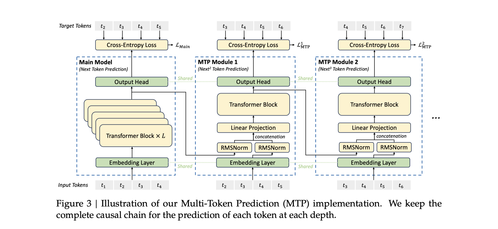

<<<<<<< HEAD

=======

>>>>>>> 3dbf1a2a103e1e9ac6ad6fb2ea7063ca3cd209f7

DeepSeek-V3 is the latest model in the DeepSeek's model family. The model itself is packed with many cummulative efforts to improve the performance of the model.

The model is literally blowing every closed source or open source model out of the water given its size.

<<<<<<< HEAD

=======

>>>>>>> 3dbf1a2a103e1e9ac6ad6fb2ea7063ca3cd209f7

But what made DeepSeek-V3 so good? Let's deep dive.

## Overall
At first you might have an impression that this model is a gigantic monster. Surely 671B is big, but it is really not that big from architecture point of view, that I will explain shortly. The model also employs multiple advanced techniques to boost the inference throughput.

## Techniques
### 1. Reduction of compute: DeepSeekMoE

DeepSeek-V3 employs the Mixture-of-Expert architecture but with a lot of modifications. The model does not make use of naive routing mechanism but dividing the experts into 2 groups: `Shared` and `Routed`.

The effect of DeepSeekMoE is validated in DeepSeek-V2, you can check out more at: https://arxiv.org/abs/2405.04434 

### 2. Reduction of VRAM: Multi-Head Latent Attention

DeepSeek-V3 uses Multi-Head Latent Attention (MLA), an enhanced version of the standard "attention" mechanism with `KQV`. Here’s how it works: before generating the Key (K), Value (V), and Query (Q), the input is first projected into a shared `latent layer` and then "decompressed" back into the standard K and V for attention. The same process is applied to Q.

This `latent layer`, called `C` (for KV and Q), acts as a compressed representation of the KV information. By caching only `C` instead of the full KV-cache, we significantly reduce VRAM usage, as the dimension of `latent C` is much smaller.

### 3. Speedup of inference: Multi-Token Prediction

Basically this allows the model to quickly generates multiple tokens in one go. In the illustration above it is 3 tokens in one go. How does it work?

The process has 3 components: The main model, MTP module 1, MTP module 2.

I prefer to think of MTP module 1,2 as "smol models" because those are basically just another model but only have 1 layer. They even share the Output Head with the main model. Step-by-step process is as follows.
- First, you generate a next token, like a normal scenario.
- Second, you take that output of the first token and feed to MTP module 1
- Second, you take that output of the MTP module 1 and feed to MTP module 2

Why we do this?
- The model will learn to generate embedding that is basically containing information of 2 next tokens -> Improve robustness
- The small models can serve as the speculative decoding models, one that is much more efficient than train entire new model.

### 4. Synthetic data: DeepSeek-R1
DeepSeek-R1 is a model with reasoning ability (just like OpenAI-o1). DeepSeek exploited this model to generate synthetic data for DeepSeek-V3.

DeepSeek-V3 is basically trained on the output of a highly reasoned model. The volume of the data is also very significant and approaching the amount of data that big tech like META having around *~15T*.

### 5. Layer-wise optimization
The first three layers of DeepSeek-V3 are dense layers, not all of which are Mixture of Experts (MoE). There are several reasons for this design, but the most notable is to preserve the model's reasoning capabilities.  

As discussed in the *Mixture-of-Parrot* paper (also referenced in my blog post below), dense models exhibit significantly better reasoning abilities compared to MoE. In large language models (LLMs), the early layers—particularly the first few—are crucial because they drive substantial transformations in the hidden states. Keeping these initial layers dense helps prevent performance degradation and maintains reasoning integrity.  

Check my blog for [Mixture-of-Parrot](/posts/10-papers-that-caught-my-attention-a-year-in-review/)

### 6. Other things
There are other things about FP8 training and cluster setup that I personally not interested in, but they have done a lot on this end to enable training 671B model on such a small budget, that is also very amazing.

## Result
What have DeepSeek-V3 gained from the above tricks?
- Very fast model (can be faster than QwenCoder-32B)
- Model can hold significant amount of information (due to MoE model advantage in [Mixture-of-Parrot](/posts/10-papers-that-caught-my-attention-a-year-in-review/))
- Overcome data limitation (Since a lot of data is synthetic)
- Significant VRAM saving in both training and inference.
- And much more in the technical report at [here](https://github.com/deepseek-ai/DeepSeek-V3/blob/main/DeepSeek_V3.pdf).

## Conclusion
DeepSeek-V3 is truly pushing what is possible in AI. Now everything that is possibly optimized and done in closed source model like ChatGPT is already proven and scaled in public. They also provide model, source code and details of how they achieve the result. They truly deserve the praise and attention of the community.
