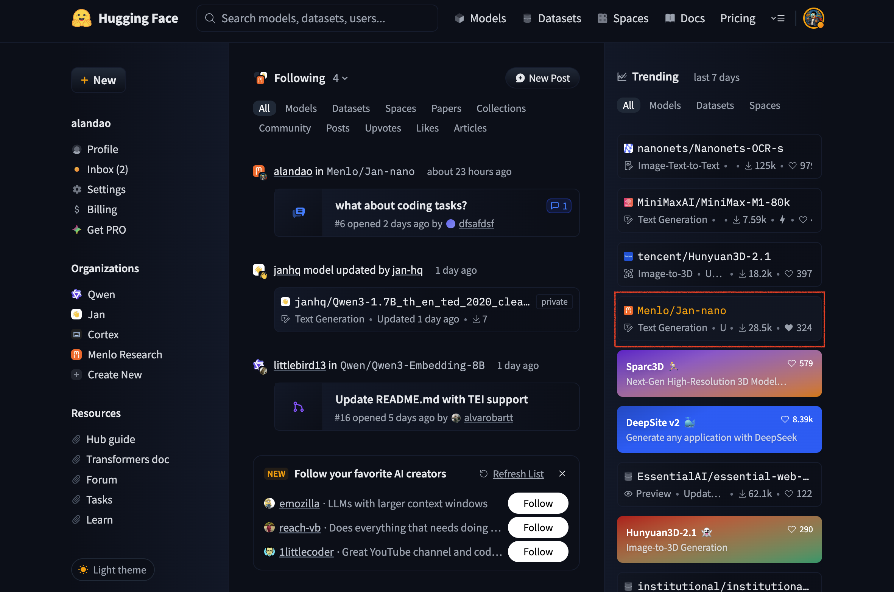
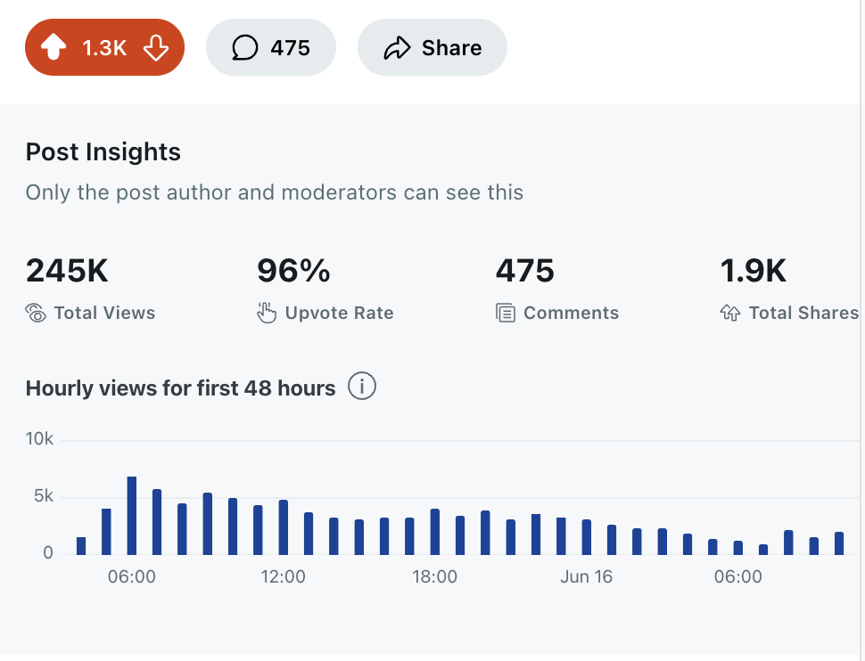
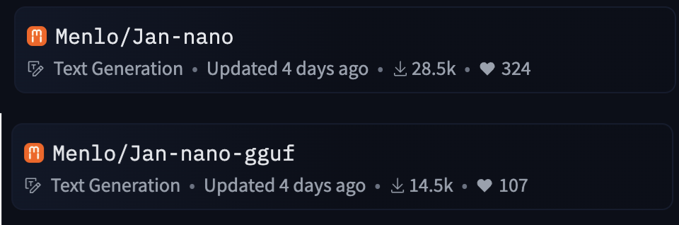

As of this moment Jun 21 2025, Jan-nano is trending on huggingface and you can see clearly from the main landing page.

Going back to 2023 when we started the company and our journey we never expected to go this far. 

We still have not made it yet, but this is the result of our long term commitment to doing open source and building what we love.

# Release stat up to 21 Jun 2025
- Reddit: we have **250k views** with **~1300 upvotes** and hundreds of comments
- Huggingface: we have **>40.000** downloads on models, trending on main landing page of huggingface.
- x.com: hundreds of reposts from community, hundreds thousands of total views.
- youtube: people are posting tutorials on how to use Jan-nano

This is an amazing journey, all thanks to the community support!

Below is demo of Jan-nano under best performance hope you will enjoy it.



# Sources
Some screenshots to record the history of things

Reddit stat

Youtube video from community

Huggingface stat
