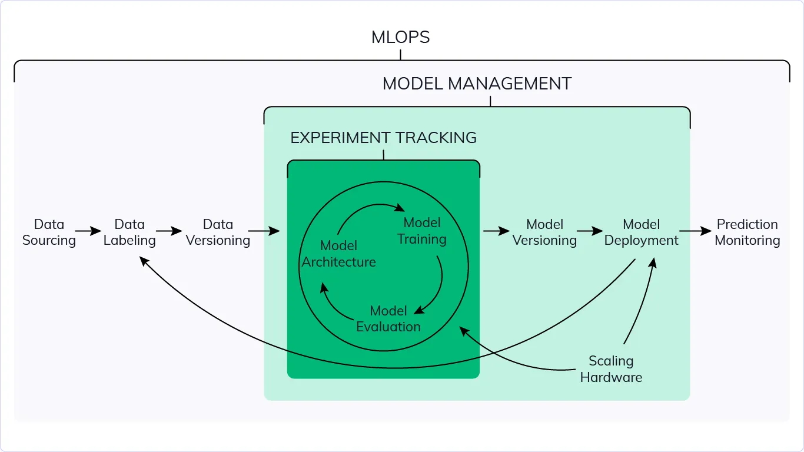

I’ve noticed that there are plenty of guides and courses on “learning MLOps” available online, but many of them fail to address these critical aspects:  

1. What the daily work looks like  
2. What roles can be transferred into MLOps  
3. Career prospects  

With that in mind, I hope to provide a practical perspective based on my personal experience. This could help you adjust your learning path (if you’re planning to transition into this position) or adapt to moving from large companies with standardized processes to smaller companies or startups.  

## Daily Work  

### **Ideal Perspective**  

When you look online, you’ll often see diagrams like the one above, describing the “activities” of MLOps. These include everything related to a “model lifecycle,” from data sourcing and labeling to versioning and beyond.  

In reality, when hired as an MLOps Engineer, chances are you’ll only handle a small portion of these tasks, or even focus on just one area, due to the following reasons:  

- The company lacks the capability or plan for data versioning.  
- Usage is too low to justify hardware scaling in the near future.  
- Existing processes (e.g., manual monitoring of model performance or reports from another team) are working fine without issues.  

In an ideal world, we’d want these problems to be solved. But the business environment we work in is far from perfect. Therefore, it’s essential to understand these limitations and adjust our expectations accordingly.  

### **Practical Perspective**  

Your job boils down to this: *“Ensuring that Machine Learning/AI runs smoothly within the organization”* (or at least that’s the employer’s expectation). Below are some common realities that those working in AI model deployment will likely face:  

1. Sometimes, your tasks will span both on-site hardware and cloud infrastructure.  
2. Sometimes, models and data are stored across Hugging Face, on-site NAS, and S3.  
3. You can’t use Kubernetes or Kubeflow to manage everything due to the distributed nature of the machines.  

From a conceptual standpoint, you or the company may aim to address these issues, but it might take 6–12 months to materialize due to logistical constraints or decisions (e.g., choosing between cloud and hardware). While researchers may support and expect you to handle these problems, the current state of the company may not have the capacity to resolve them, leaving you to manage these challenges daily.  

There are also discrepancies between tooling expectations and reality. For example, you might spend time earning certifications for tools like:  

- Vertex AI on GCP  
- Databricks AI  
- AWS AI  

However, in practice, the tools you actually use could be vastly different:  

- Runpod or GPU-rich clouds (as traditional clouds often have expensive GPUs)  
- Kubernetes (bare metal)  
- Proxmox  
- … (depending on the company’s size and scale)  

## Transitioning into MLOps  

No one is born an MLOps Engineer. Here are the roles that can more easily transition into MLOps:  

### **From DevOps**  

For experienced DevOps professionals, transitioning to MLOps isn’t too difficult, as the overarching goal remains the same: supporting the efficient operation of ML systems within the company. If you’ve worked in DevOps, you already have a significant advantage in mastering cloud services, tooling, and especially experience in on-premise deployments or setting up systems using GPU-enabled clouds like Runpod. These skills will help you adapt and thrive in an MLOps role.  

### **From Sys-admin**  

Similarly, Sys-admins with strong technical backgrounds can transition to MLOps without much difficulty. With experience in server configuration and system resource optimization, you bring valuable skills to small AI-driven companies that often rely on existing hardware or non-standard clouds (like Runpod) and require you to set everything up from scratch.  

If you supplement your skills with experience in cloud tools, cluster management, or container tools like Docker and Kubernetes, you’ll have a significant advantage. However, you’ll also need to acquire specific ML-related knowledge to be effective in this role.  

### **From… fresh graduates**  

If you’re a fresh graduate, having a solid foundation in IT system deployment (as seen in the two roles above) is crucial before you can genuinely work as an “MLOps Engineer,” especially at small and medium-sized companies. Working in an MLOps-specific role without these foundational skills might be possible at large companies with standardized processes, but such opportunities are exceedingly rare.  

## Conclusion  

This is just a personal perspective, as I’ve noticed that many advertised courses and toolsets online seem heavily biased compared to the real-world day-to-day work of MLOps Engineers. I hope the ideas shared here help you balance your expectations and better understand what to expect when you see a “MLOps Engineer” job posting online.
