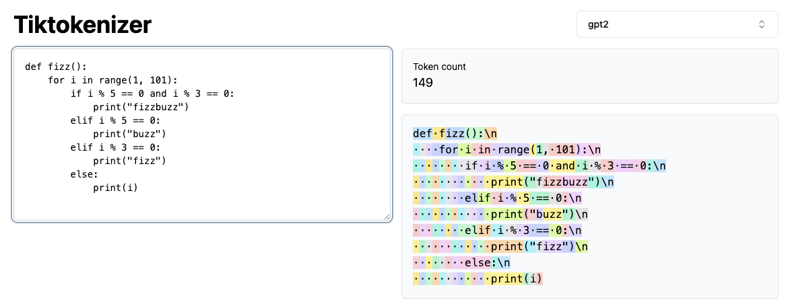
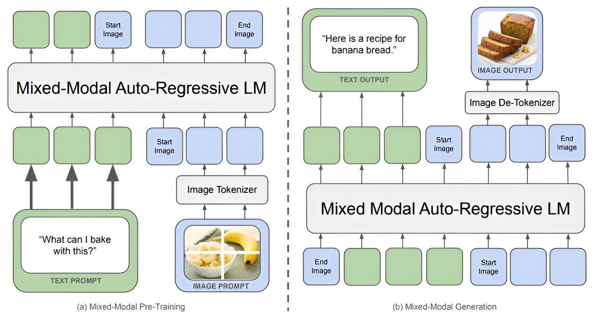
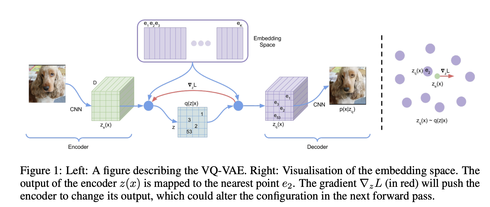

In LLMs, a very fundamental step is tokenizing. In order to make the LLM understand what you are inputing you need to convert text into numbers.

But one might wonder? how about images, sounds, ... everything else but text?

That's exactly the question I will answer today.

## The Logic Behind Tokenizing an Image

To tokenize an image, we must first understand the fundamental principles behind tokenizing text. There are three key aspects of text tokenization that differ significantly from image tokenization:

**Discrete Nature of Text**

Text is composed of a fixed set of alphabets and vocabularies, allowing us to construct words, phrases, and sentences from a finite set of building blocks. For example, with 24 letters in an alphabet, we can create a vast range of texts. Moreover, each vocabulary unit (e.g., the letter "a") is distinct and cannot be compared directly to another unit (e.g., the letter "b").

**Continuous Nature of Images**

In contrast, images are continuous and lack clear boundaries between individual components. Pixels in an image can have a wide range of intensity values, from 0 to 256, making it challenging to define distinct vocabulary units. Additionally, images consist of billions of pixels, making the potential vocabulary vast and complex.

**Challenges in Tokenizing Images**

To tokenize an image, we need to address two fundamental challenges:

1. **Discretization**: We must find a way to represent the continuous image data in a discrete format, allowing us to identify distinct units or tokens.
2. **Vocabulary Reduction**: We need to reduce the complexity of the image vocabulary, avoiding the need to tokenize every individual pixel. This requires developing strategies to group or aggregate pixels into meaningful units.

By understanding these challenges, we can begin to develop effective methods for tokenizing images and unlocking their potential in various applications.

## Introducing Chameleon paper from Meta

The idea of Meta research has introduced in the Chameleon paper are:
- You can tokenize an image
- You can train image generation directly on LLM by
    - using the vocabulary from the tokenizer of the image by 
    - merging the vocab of the image tokenizer with LLM tokenizer

**Let's dive into how that happen**

Meta's paper:
- [Chameleon: Mixed-Modal Early-Fusion Foundation Models](https://arxiv.org/abs/2405.09818)

### VQ-VAE

In order to:
- Reduce the number of tokens per image (not tokenize all pixels).
- Have a fixed vocabulary for image.
- Have an image tokenizer.

Meta has used one model with the architecture claimed to be the same as VQ-VAE (Vector Quantized Variational autoencoder).

From the image above we can do some concept mapping.
- The vocabulary in this case is named "codebook" inside VQ-VAE architecture, the "codebook" will have a vocabulary of size 8192 and all the tokenizer needs to use this vocabulary to tokenize the image into 1024 tokens.
- The tokens are the list of numbers constructed from 8192 size codebook.

So what has been done in the paper? There are a few.
- They add 8192 tokens from VQ-VAE codebook into the vocabulary of the LLM
- They train a new tokenizer with mixed dataset containing the tokens of the text + tokens from the image inside the document (mixed datatype documents not just text).

## How to replicate that?
The thing you might notice is that there is actually no code or implementation details from the paper? But can we do something simiilar.

I have implemented the "image tokenizers" with similiar features in this repo
- [Open Chameleon](https://huggingface.co/alandao/open-chameleon)

What I have done?
- I re-purpose (not retrain entirely) llama3 tokenizers.
- Because llama3 tokenizers use tiktoken there is no need to retrain the tokenizers entirely because it will priority full token and will not break words into sub-word if the entire word is matched.
- I pad the value of codebook to the size of llama3 vocabulary size (beginning_pos = llama3 vocab size + codebook value ).
- I produced some nominal values named "<dis_...>" in order to represent for each of the image tokens 

Using the above technique we can decode and encode the images datasets using VQ-VAE models, but at the same time, we can generate a dataset that can be trained on tradinational LLM model.

## Conclusion
It is not very sure at this moment in time whether we are reaching a stagnation in LLM capability. However, since LLM currently is only trained on text and not truly multimodal, extending scope of "tokenizer" like Chameleon can prove some fruitful results in the upcoming development of LLM models.

