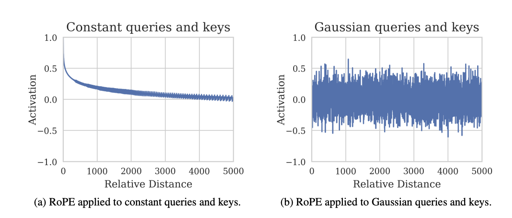
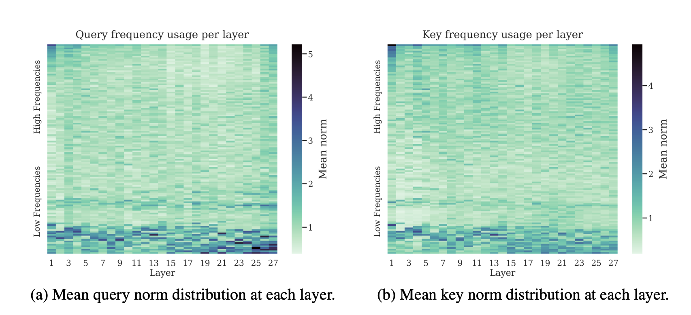
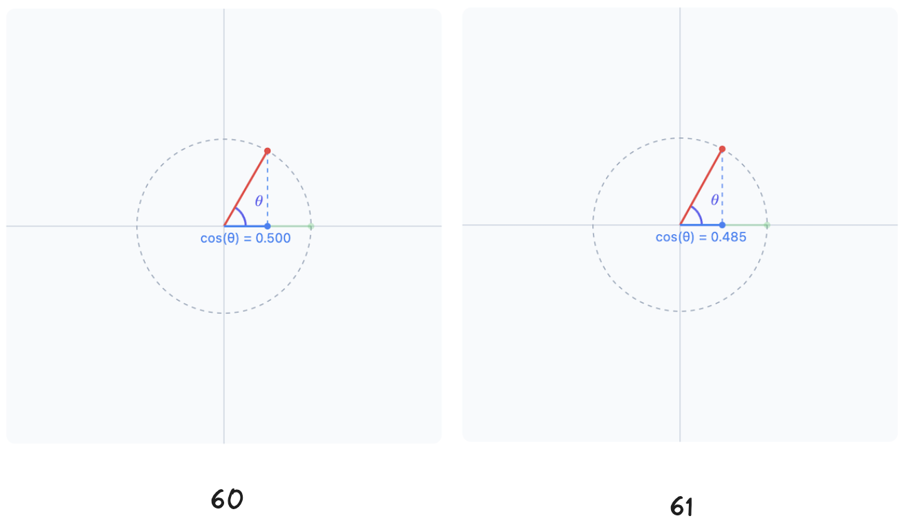

Up until now everyone has been using "Rotary Position Embedding" (RoPE) like a default method for positional encoding for awhile. However, specifically how and why RoPE makes things "better" is still a little unexlored.

Luckily there is a paper [Round and Round We Go! What makes Rotary Positional Encodings useful?](https://arxiv.org/abs/2410.06205) addressing this specific issue. I found a few of their results are quite interesting.

## 1.RoPE does not necessarily decay activations with distance:
In the original paper [RoFormer](https://arxiv.org/abs/2104.09864) the authors made an analysis about the fact that RoPE has some level of decay of the increasing of the context len. However, the new paper we are discussing here argued that this is not actually an practical analysis. Let's take a look at the below result.

As you can see on the left is the result from the original paper with constant queries and keys, which having the value of "1". The interesting thing is that this might not be a practical assumption. In practice, queries and keys are never having values of 1, but most likely having some sort of randomized distribution.

To challenge this analysis, the authors in the new paper re-test the idea with gaussian queries and keys. As can be seen from the second chart, it is very obvious that there is no visible decay with gaussian queries and keys. On a practical note, this also is closer to what we might see in real scenario.

Since there is no visible decay in attention when using RoPE over a long context len, this might contribute a bit to the fact that most of the current models using RoPE have significantly long context windows.

## 2.Not all frequencies are the same, lower frequencies are not important for positional information, only semantic:
As you might have known a "rotated" embedding does not simply just use one angle, but a range of them (if not please visit my old blog [post](/posts/rotary-position-embedding-rope-down-to-the-bone)). Specifically following this formula.

$$G = g_k = \theta^{-\frac{2(k-1)}{d}} \quad \text{for} \quad k = 1, \dots, \frac{d}{2}$$

Where k is just position of the complex number pair, d is basically dim of embedding.

Ideally because there are so many frequencies that are being used here (based on so many angles) for just one single embedding, it is pretty straighforward to think not all of the frequencies are being used in the same way.

From the paper, it is observed as such.

As per observed from the paper frequencies usage and activities vary significantly because low and high frequencies. In this case you can see the low frequencies are made use more in the charts.

More interesting results:
- The usage of low frequencies is not for "postional" and mostly contain semantic (inherently knowledge) information, there are some math involved in proving this in the paper
- High frequencies on the other hand, containing positional information and very few semantic information (information about which phrase come first and last etc)

## 3. Low frequencies can be removed entirely
The above result combined with some observations in practice:
- Llama3.1 model seems to perform well on very high base wavelength (theta) on long context len.
- Semantic bands are not robust over long contexts.
- If base wavelenght is high, the low frequencies are very low, and this will make the change in the value of the queries and keys almost negligible.

Example: If increase the angle to 60 to 61 by multiply a complex number with angle 60 to a complex number having angle of 1, the projected value is very small.

Well! In practice the number is much much smaller due to the base frequency is extremely high (you can check llama3.1 and gemma model). Because the value of the base frequencie are so high, the impact of the frequencies to actual queries and keys values are also very small.

With the above observations, in the paper the author has tested removing lower frequencies entirely and only keep higher frequencies by introducing a new method to do Rope.

The paper introduce p-Rope which essentially is a way to do rope which control on which frequencies are exlcuded. In this case if excluding the lower frequencies, models are showing the same performance. This might be due to the fact that the low frequencies contain only semantic information.

## 4. Implication of extrapolation and training
This part i also make some deductions but we can see a few things.
- Llama3.1 has shown very robust ability to extrapolate to very long context len beyond the training set (per their paper and technical report)
- The model can apply its understanding of short data to longer contexts. In other words, you don't need the same amount or quality of data for longer context windows to get high performance. The model can still perform well on longer inputs by using the semantics from the shorter data it was trained on.
- Control the usage of frequencies in LLM model can increase the model performance on longer/shorter context len significantly.

## Conclusion
I hope this summary has given you a deeper understanding of what makes RoPE so useful, especially in the context of large language models. The paper challenges some older assumptions, showing that RoPE maintains its effectiveness over long contexts and how different frequency bands serve unique roles—low frequencies carrying semantic meaning and high frequencies capturing positional data.

With innovations like p-RoPE, which streamlines the process by excluding lower frequencies, there are exciting opportunities to improve model performance without sacrificing efficiency. I hope you’ve learned something new, and that these insights spark more curiosity about the intricacies of AI!

