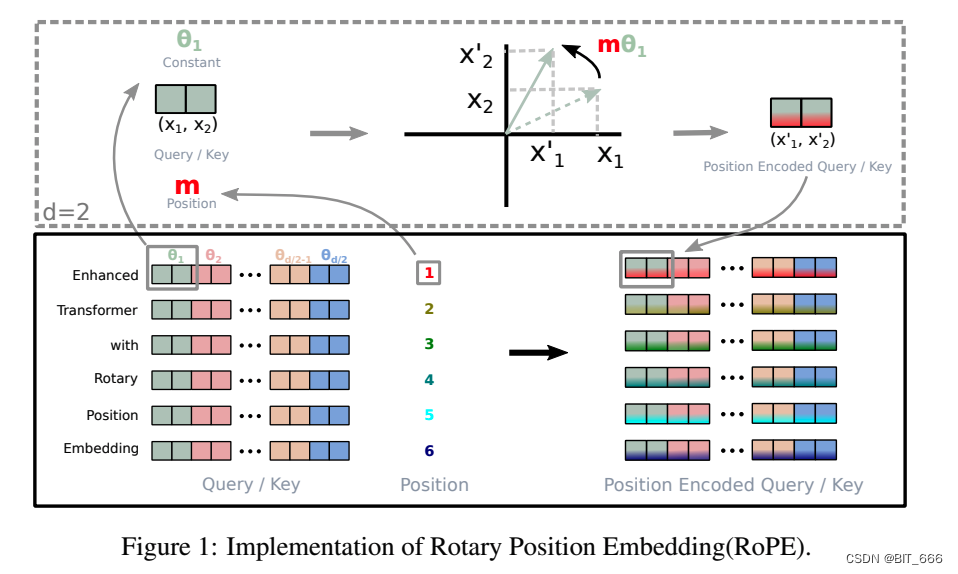

You may have heard everywhere on Reddit or on Twitter about...

> "Model A has RoPE implemented."

> "We can make it run longer by changing the RoPE scaling."

...and so on.

But for real? What the hell is RoPE and how does it work? They say something about sin and cos, but what does that even mean? Now, I am about to debunk all of that, for your sake.

## The intuition behind RoPE

In order to understand what is RoPE firstly we need to review some high school math.

### Complex Number
In mathematics, a **complex number** is a number that can be expressed in the form:
$$z = a + bi$$
where:
* a is the **real part** of the complex number
* b is the **imaginary part** of the complex number
* i is the **imaginary unit**, which satisfiee:
$$
i^2 = -1
$$

Because complex number has 2 parts `a` and `b`, you can see it can be viewed as a vector like below:
$$z = a + bi \quad\longleftrightarrow\quad (a, b)$$

But here comes the fun part, so if it's a vector, if we visualize it onto a vector space it must have things like:
- An angle (compared to x axis) - or equivalently the direction of the vector.
- Magnitude (how long the vector is).

By that we also have another way to write a complex number with vector intution below.

### Polar Form of Complex Number
Complex numbers can also be expressed in **polar form**, firstly we need to find the "magnitude" part:
$$
r = \sqrt{a^2 + b^2}
$$

Secondly, we need to find the "angle" of the vector  (a,b):
$$
\theta = \tan^{-1}\left(\frac{b}{a}\right)
$$

Thus, the polar form of \( z \) can be written as:

$$
z = r e^{i\theta}
$$

Or, if you use Euler's formula (If you do not know what is Euler's formula you can also check [Euler's formula](/posts/eulers-formula-proof/) post ) it can also be written as:

$$
z = r (\cos \theta + i\sin \theta)
$$

### Multiplication of two complex number in polar form

Assuming we have two complex numbers z1 and z2 represented in polar form as 
$$ z_1 = r_1 \cdot e^{i\theta_1} $$ 
$$ z_2 = r_2 \cdot e^{i\theta_2} $$
$$
\text{The product } z_1 \times z_2 \text{ is given by:} \\\
z_1 z_2 = (r_1 \cdot e^{i\theta_1}) \cdot (r_2 \cdot e^{i\theta_2})
$$

Using the properties of exponentials, we can simplify this expression to:

$$
z_1 z_2 = r_1 r_2 \cdot e^{i(\theta_1 + \theta_2)}\\\
= r_1 r_2 \left(\cos(\theta_1 + \theta_2) + i\sin(\theta_1 + \theta_2)\right)
$$

As can be seen from the result above, we can see some features stand out from this operation:
- The magnitude of the two vector got multiplied into each other
- The direction of the vector is added to each other (Assuming a complex number is also regarded as a vector)

This makes this operation perfect for anything that is involing encoding "direction (or angle)" and magnitude

## RoPE

Since we got all the intution down we can revisit this chart below.

*source https://arxiv.org/pdf/2104.09864v4*

As you can see the core idea behind RoPE is that you can incorporate the position of a token information into the embedding by effectively "tilt" the angle of the vectors that constructs that embedding vector. Conveniently, this is exactly what we have from using complex numbers. So how we go about doing this? Here are steops:
1. We need to specify the logic on how each position is corresponding to which angle (first token is 10 degree second is 20 etc.....), this is normally done using "frequency" value so that each position will have a different fixed angle.
2. Represent each position using a complex number, possibly in **polar form**! (Check above)
3. Split your embedding vector into sub vectors (pair of 2) and since a vector with 2 values can be considered a complex number, we can rewrite it into **polar form**!
4. Encode information of positions into each embedding multiply the **position(currently is a polar form complex number)** x **Query/Key (currently also represented as complex numbers)**
5. Voila! we got positioned encoded query/key on the right.

You can check the function `apply_rotary_emb` in llama3 model implementation, everything happens exactly like what I have described.

## Conclusion
By leveraging features of complex numbers, the positional information has been encoded into the attention mechanism of transformer model. Because the encoded information is also effectively an "angle" information, in theory there should be no upper bound or limit in the number of positions you can encode. The positonal information also is encoded dynamically in attention mechanism, there is no fixed context-len for the model but you can expand it as long as you have more data, compute. This method has proven it robustness and effectiveness given the fact that many users, companies can quickly extend the context-len of llama3 which was effectively just 8192. Here is some posts for referrence purposes.

[LLama-3-8B-Instruct now extended 1048576 context length landed on HuggingFace](https://www.reddit.com/r/LocalLLaMA/comments/1cg8uzp/llama38binstruct_now_extended_1048576_context/)
[Extending Llama-3's Context Ten-Fold Overnight](https://arxiv.org/abs/2404.19553)

But all of that comes from the intution of using complex numbers is quite fascinating!
