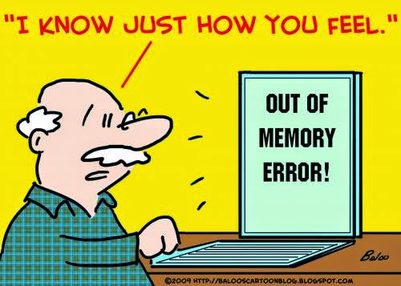
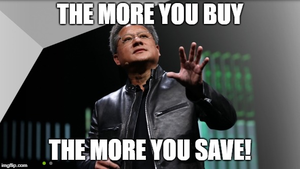
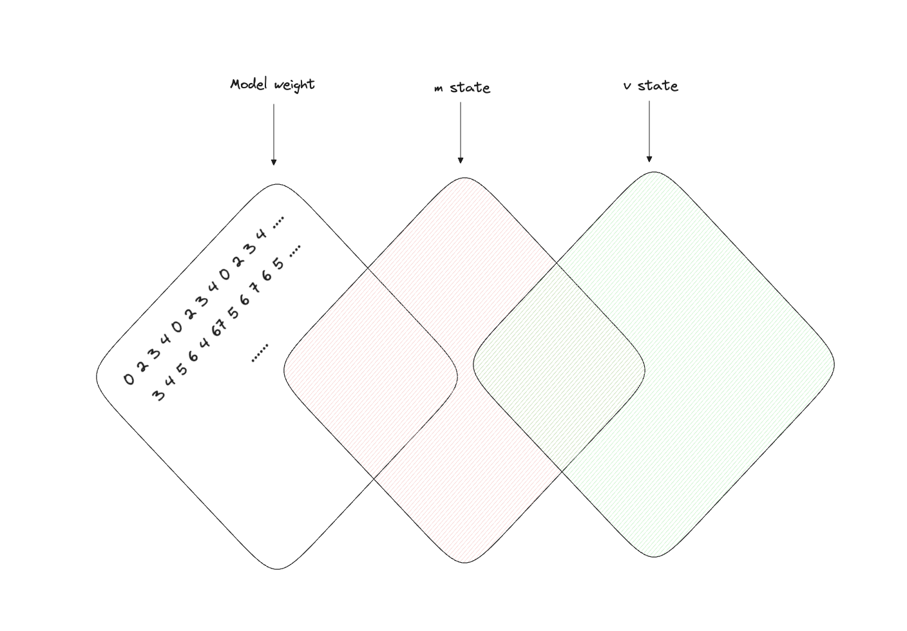
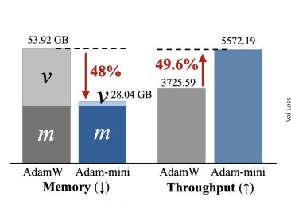
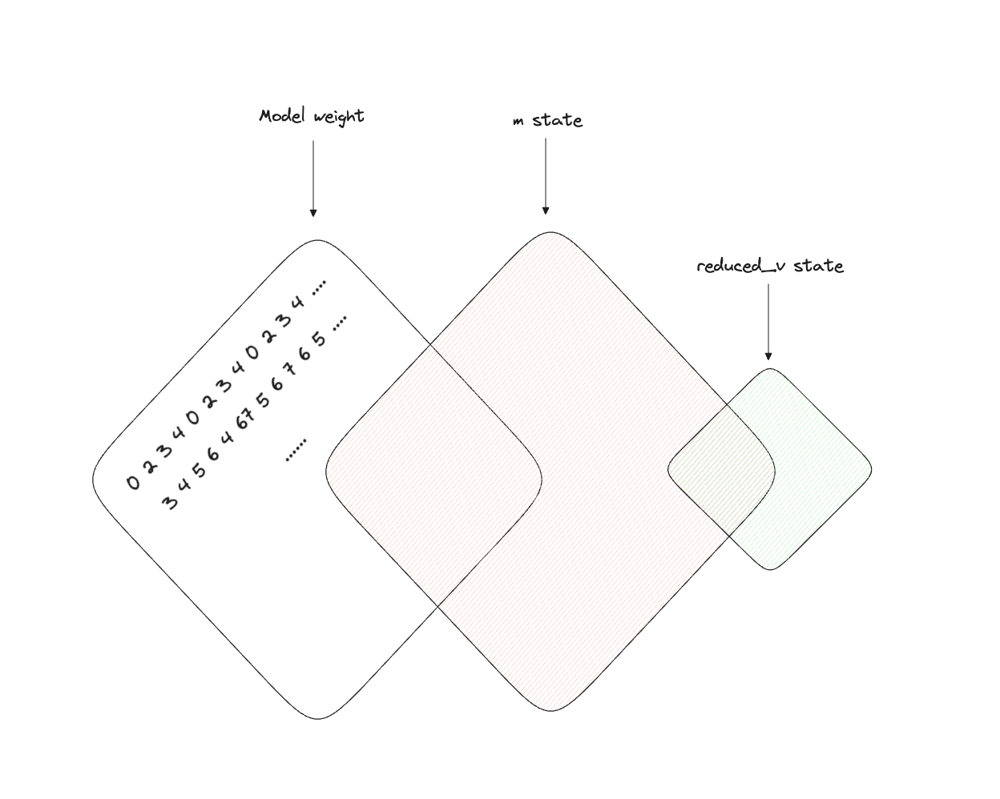

## The error of death
Have you been constantly battling with VRAM usage in finetuning LLM, and constantly struggling with the below error

```
RuntimeError: CUDA error: out of memory..
```

The above is the destroyer of joy, the sudden stop of happiness and the most dreadful error you might have faced as someone trying to train an AI model, or more specifically LLM (cuz I assume it's the most VRAM intensive among the bunch).




## What is eating up VRAM in my training pipeline?
Technically speaking when you train an AI model, you will need to have enough VRAM, for whatever you have "allocated" to the memory.

But hey, look this is 2024, and everyone got too many on their plates already! No one will code the entire training pipeline, including optimizer, parameters, ... from sratch for no purpose? Hence, I will cut to chase now and tell you what are the culprit that most of the time, will eat up the VRAM during the training/finetuning process.

During most LLM training/finetuning there are 3 main things that will cost you your dear VRAM:
- **Model weight** :the number of parameters 7B, 13B,... and so on
- **Intermediate activations**: activations of layers during a forward pass
- **Optimizer state** :most used optimizer is AdamW and its variance

The above list looks intuitive for the first two items, obviously you need to store model weight and activations to be at least able to train a model, but what about optimizer?

I have realized a lot of people acutally skipped this part because Adam and AdamW optimizer has been in practice for so long that people just keep using it without knowing the exact impact, or its memory footprint like at all and just accept that LLM training will cost a lot of VRAM and maybe??



Well, jokes asides, you can do something about like quantize the weight, choose a smaller model etc... But today I will tilt your attention to a different thing called the optimizer, and in this case AdamW!

## What exactly is AdamW, and what is it allocating?
AdamW (Adam with Weight Decay) is an extension of the popular Adam optimizer, designed to address some of the shortcomings of standard Adam, particularly in the context of large neural networks like LLMs. To understand why AdamW can be so memory-intensive, let's break down what it's actually doing and storing in memory.

### The Basics of Adam
Adam (Adaptive Moment Estimation) maintains two moving averages for each parameter in the model:

1. The first moment estimate (mean of gradients)
2. The second moment estimate (uncentered variance of gradients)

These moving averages allow Adam to adapt the learning rate for each parameter individually, which can lead to faster convergence and better performance, especially for problems with sparse gradients.

### AdamW's Additional Complexity
AdamW builds on Adam by decoupling the weight decay from the gradient update. This seemingly small change can lead to better generalization, especially for large models. However, it comes at a cost in terms of memory usage.

### Memory Footprint of AdamW
For each parameter in your model, AdamW needs to store (asides from the model weight and activations, of course):

1. The first moment estimate (m)
2. The second moment estimate (v)

This means that for a model with **N parameters**, AdamW effectively needs to store an extra **2N parameters** (and probably some more) number of paramemters for the update (because each parameters need to have 2 values in the optimizer).

Visually, m and v should carry as many value as exactly the weight




The m and v state will be use to calculate the adaptive rate in which each paramemeter will be updated. Or, you can understand it as it will be fused together to make a "direction vector" for the gradient to make the gradient going into a better direction for optimization.

### Example:
Let's say you have to train a Bfloat16 model with 7B parameters you will cost:
- Model weight: ~16GB
- Optimizer statts: ~32GB (m and v)
- Activations: Depending on batch size assuming it's just zero still
Total VRAM: ~48GB

Let's say you have a decent budget and your GPU is A6000 ($5000 GPU), without allocating any space to store activations you have already ran out of space since A6000 only have 48GB Vram you are dead in the water already.

## What to do?
QLoRA and LoRA is nice, but what to do if you still want to full finetune anyways with the limitation of VRAM

Understanding the nature of the optimizer's memory footprint can give us some options

### Option 1: Modify the optimizer (AdamW)
If you pay close attention you can do something to the optimizer, you can reduce the resolution or number of values you decided to save for example

I n the paper below they decided
[Adam-mini](https://arxiv.org/pdf/2406.16793)

And the result in FP32 is quite staggering


They basically averaging out the the v value calculation in a average grid style leading to much smaller impact on the VRAM of v-state so the original image now looks something like this


But in theory you can choose to modify the optimizer state calculation in a different way and see what is the result for yourself, even removing v-state entirely!

### Option 2: Quantize the optimizer
Well if you're quantizing the weight, you end up with "QLoRA" but what if you're just quantizing the optimizer?

Well that another option, in fact there is a dedicated section for that here [8-bit optimizers](https://huggingface.co/docs/bitsandbytes/main/en/optimizers)

Basically what you can do is:
- Keep the model as full parameters
- Quantize the optimizer on 8-bit

Maybe it will take more time to converge or loss will go down slower, but you will be able to keep the output of the training weight in full FP16 with a significant reduction in VRAM usage

### Option 3: Combine option 1 and 2
You can start with the quantized version of the optimizer in option 2, and try to implement the VRAM reduction version of it (like adam mini) in option 1 so you will get vram reduction in quantization and in modification of the optimizer!

### Option 4: Use a different optimizer
There are many other optimizer like Lion optimizer for example [Lion](https://huggingface.co/docs/bitsandbytes/main/en/reference/optim/lion)


## Conclusion
You can reduce VRAM usage by the 4 options above without resorting to LoRA or QLoRA (or buy more gpus) just yet. Training an AI model is inherently a stochastic and optimization process, so by understanding it you can also somewhat control the requirement and make some trade-offs to make your training possible without resorting to quality destroying method like quantizing the weight of the model. Also, sometimes you will experience faster convergence even though you are on a different optimizer or custom optimizer (like in adam-mini case) so more VRAM <> better.


