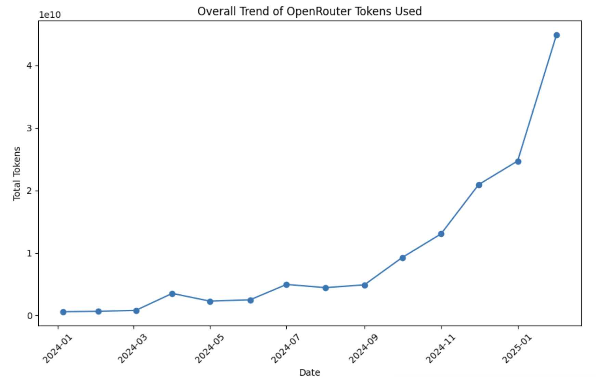

If you’ve been keeping an eye on OpenRouter, you might have noticed that its total token usage has skyrocketed. In fact, I’ve tracked the public data from their website and compiled some stats, showing an incredible 76x growth since 2024 (y-axis is in 10B).

So, what’s driving OpenRouter’s success?

## What give way to the success of OpenRouter?

OpenRouter’s growth isn’t happening in isolation—it’s closely tied to the rapid adoption of AI-powered coding assistants. A big part of this shift started with Cursor, an AI-driven development tool that took off in August 2025. The increasing demand for AI-assisted coding has fundamentally changed how developers work, and OpenRouter has positioned itself at the core of this transformation.

A look at the top apps by token usage on OpenRouter helps illustrate this:

**Top 5 Apps by Total Tokens**  
| Title               | Tokens        |
|---------------------|---------------|
| Cline               | 46,790,000,000|
| Roo Code            | 12,800,000,000|
| Aaru                | 10,364,000,000|
| SillyTavern         | 7,469,500,000 |
| OpenRouter: Chatroom| 6,120,000,000 |

## The AI Coder Trend: Cursor Ignited the Spark 
The rise of **AI coders**—tools that automate code generation, debugging, and optimization—has revolutionized software development. While Cursor is often credited with sparking this movement in **August 2024**, its success has paved the way for subsequent innovations like **Cline**, a next-gen AI code editor. These tools reflect broader trends driving the industry:  

- **Generative AI adoption**: A majority of developers now view AI code editors as the most realistic productivity tool available today, driving demand for infrastructure platforms like OpenRouter that power these tools.  
- **Productivity gains**: Studies show developers using generative AI can boost efficiency by up to **10x**, making AI coders indispensable. For instance, Pieter Levels famously used an AI-powered code editor to build a viral 3D flight simulator in just 3 hours, generating $50k in revenue—a feat he achieved with no prior game development experience.¹  

Cursor’s ascent underscores this shift: by demonstrating the power of AI-driven code editing, it amplified market awareness for tools like **Cline**, which builds on Cursor’s momentum. While Cursor itself does not directly integrate with third-party apis, Cline is open to any third-party apis, models as long as it complies with OpenAI compatible standards (and they directly integrate OpenRouter as well). This integration allows Cline to cater for the need of "less reliant" on a single AI providers like ChatGPT, Cursor and played very well with developer community.  

The synergy between AI code editors (like Cursor and Cline) and backend AI infrastructure (like OpenRouter) highlights a critical ecosystem dynamic. Cline’s integration with OpenRouter not only enhances its own capabilities but also reinforces OpenRouter’s position as a foundational platform for the AI developer ecosystem. As tools like Cline gain traction, they fuel OpenRouter’s growth, creating a virtuous cycle of innovation and adoption.  

## OpenRouter’s Strategic Edge
OpenRouter’s rise isn’t just about AI hype. It has successfully leveraged two major industry shifts:
- Developers moving away from proprietary models: A growing number of developers are abandoning OpenAI’s models in favor of open-source alternatives. 
- Customization and flexibility: Many AI-driven tools, such as Cursor and DeepSeek R1, rely on OpenRouter’s API to deploy fine-tuned models without needing to build infrastructure from scratch. This adaptability has made OpenRouter the go-to platform for cutting-edge AI applications.

This alignment with open-source trends (e.g., customizable models, ethical AI practices) positions OpenRouter as the backbone for next-gen developer tools.

## OpenRouter’s Dominance Despite Challenges
OpenRouter is well-positioned to dominate this space. **Developer demand is stronger than ever**, with tools like Cursor and AI-powered debugging systems depending on scalable APIs to function effectively. The **open-source movement is gaining traction**, driving developers toward customizable, ethical AI solutions—an area where OpenRouter excels. Moreover, its **expanding ecosystem**, now powering hundreds of app due to ease of use, strengthens its position through network effects, making it a central hub for next-gen developer tools.

There are several challenges related to APIs and standards. If you’ve used similar services, you’ll notice that OpenRouter's main selling point is its highly "adaptive" approach to OpenAI-compatible standards. They also make a strong effort to integrate directly with various applications, supporting customized API parameters. However, as the open-source ecosystem continues to evolve, OpenAI’s API standards have become increasingly restrictive. This is because OpenAI has diverged from the open-source philosophy—hiding models like ASR and removing transparency features (e.g., the "think" tag)—which contrasts with the open-source approach.

That said, whether OpenRouter will emerge as the winner in this "standards game" remains uncertain. History has seen many "standard wars" play out in tech, such as VHS vs. Betamax, Blu-ray vs. HD DVD, and even the battle between proprietary and open-source software ecosystems. Often, the winner isn't determined by technical superiority but rather by factors like market dominance, partnerships, and ecosystem lock-in. In this case, OpenAI's influence and resources give it a significant advantage, but OpenRouter’s adaptability and commitment to compatibility could allow it to carve out a niche, especially among developers seeking flexibility outside OpenAI's constraints.

## Conclusion  
OpenRouter’s rise isn’t just about numbers—it’s about enabling a **new paradigm** in software development. By empowering tools like Cursor and embracing the AI Code Editor trend, it’s redefining how code is written, tested, and optimized. As trends like **multimodal AI** and **vertical agents** take hold in 2025, OpenRouter is poised to stay at the forefront, turning developers into supercharged innovators.  
