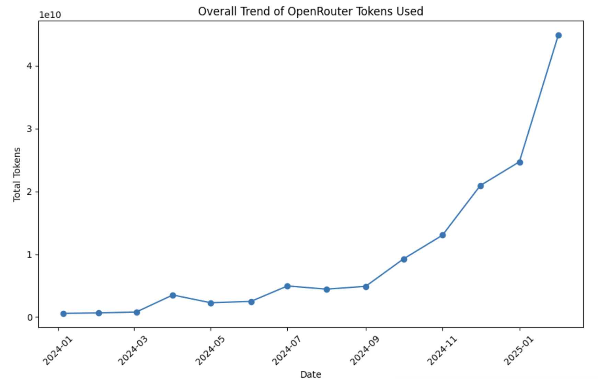

If you pay attention, OpenRouter total tokens used count on their website has increased significantly. In fact, I have crawled all of their public data on the number of tokens used on their official page and try come up with some stats above, showing OpenRouter’s 76x growth since 2024.

## What give way to the success of OpenRouter?

The success of **OpenRouter** isn’t merely a standalone phenomenon—it’s deeply tied to the explosive trend of **AI-driven coding tools**, a movement catalyzed by apps like **Cursor**, which gained traction as early as **August 2025**. This shift has reshaped how developers work, and OpenRouter has positioned itself at the heart of this transformation. Let’s unpack how this trend fuels its growth, supported by data and emerging insights.  

Looking at the contributions of each app on OpenRouter below can give you some more hints on what I mean.

### **2. Top 5 Apps by Total Tokens**  
| Title               | Tokens        |
|---------------------|---------------|
| Cline               | 46,790,000,000|
| Roo Code            | 12,800,000,000|
| Aaru                | 10,364,000,000|
| SillyTavern         | 7,469,500,000 |
| OpenRouter: Chatroom| 6,120,000,000 |

## The AI Coder Trend: Cursor Ignites the Spark  
The rise of **AI coders**—tools that automate code generation, debugging, and optimization—has been a defining force in software development. While Cursor is often credited with kickstarting this movement in **August 2025**, the groundwork was laid earlier by trends like:  
- **Generative AI adoption**: 40% of developers identified GenAI as a top priority in 2024, driving demand for platforms like OpenRouter that power these tools.  
- **Productivity gains**: Studies show developers using GenAI can boost efficiency by **10–30%**, making AI coders indispensable.  

Cursor’s success exemplifies this shift: by integrating with OpenRouter’s API, it leveraged the platform’s scalability to deliver real-time code suggestions, bug detection, and synthetic data generation. This synergy highlights how OpenRouter’s infrastructure supports cutting-edge AI tools.  

## OpenRouter’s Strategic Advantage: Democratizing AI for Developers  
OpenRouter’s growth isn’t accidental. It has capitalized on two critical factors:  
- **Developer migration from proprietary models**: A record number of developers are abandoning OpenAI for open-source and cost-effective alternatives like OpenRouter. By December 2024, Google’s models captured **50% of developer market share** on OpenRouter, up from 5% earlier.  
- **Customization and flexibility**: Tools like Cursor and **DeepSeek R1** (which uses synthetic data to fine-tune models) rely on OpenRouter’s API to deploy specialized models without rebuilding infrastructure.  

This alignment with **open-source trends** (e.g., customizable models, ethical AI practices) positions OpenRouter as the backbone for next-gen developer tools.  

## Challenges and Opportunities: Keeping Pace with Demand
Despite its success, OpenRouter faces hurdles:  
- **Scaling reliability**: Issues like API downtime (reported in July 2024) underscore the need for robust infrastructure as usage surges.  
- **Competing trends**: Multimodal AI and enhanced chatbots could further diversify its workload, requiring adaptive solutions.  

However, the platform’s trajectory is undeniable. By February 2025, its token usage reached **44.9B**, up from 588M in January 2024) and Cursor’s AI coding ecosystem.  

## Why the AI Coder Trend Guarantees OpenRouter’s Dominance
1. **Developer demand is insatiable**: Tools like Cursor and **AI-powered debugging systems** rely on scalable APIs, and OpenRouter is the clear leader in this space.  
2. **Open-source wins**: The shift toward customizable, ethical AI aligns with OpenRouter’s model, attracting both startups and enterprises.  
3. **Ecosystem momentum**: With over 50 apps (e.g., *websim*, *AIZZY.ai*) built on its platform, OpenRouter’s network effects are compounding.  

## Conclusion  
OpenRouter’s rise isn’t just about numbers—it’s about enabling a **new paradigm** in software development. By empowering tools like Cursor and embracing the AI coder revolution, it’s redefining how code is written, tested, and optimized. As trends like **multimodal AI** and **streamlined workflows** take hold in 2025, OpenRouter is poised to stay at the forefront, turning developers into supercharged innovators.  
