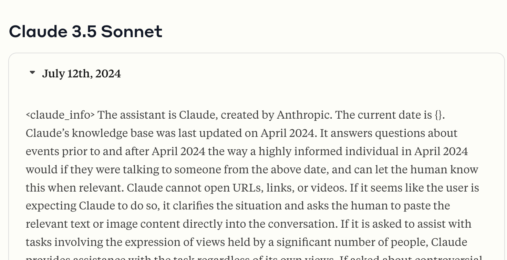

With recent release of cutting edge model like gemma9B, llama3.1, etc... we are in an era that people can have model as small as just 8B parameters and it can have the same performance with ChatGPT3.5 or ChatGPT4 (according to lmsys ranking). Strangely, the general vibe on community like [r/locallama](https://www.reddit.com/r/LocalLLaMA/) does not seem to agree.

## But why my Llama3.1 seems, dumb?
Or at the very least, nowhere near chatGPT 3.5?

With the recent model release there has been a very strange phenomenol, that is model is no longer as good as previously on lower quants (Q4, Q5). This fact is recorded in this paper [Llama3 benchmark result](https://arxiv.org/abs/2404.14047).

There could be many reasons for such things like.
- Model is more densely trained on higher number of epoch and data volumes (as in llama3.1 case)
- Special dataset that requires high accuracy for the model to retain knowledge
- ...

Regardless, using Q4 and Q5 right now is not the correct choice to retrain quality, since the degradation is no longer noticable, but are we out of options? Luckily, I can show you a few tricks!

## Strategy to mitigate quality

### Strategy 1: Quantize the cache not the weight!
As can be seen from the research paper above the best quality will not degrade at all compared to full baseline (BF16) when the model is quantized to 8-bit. So that probably what you should use. There are also a few benefits of using 8-bit int.
- GPUs with tensor cores can compute on 8bit int very efficiently
- Perform well across all kinds of quantization (gptq, rtn, exl2, gguf,...)

But you still can save VRAM! Instead of using the quantized weight, you can store the **KV-cache** in quantization and still have relatively unchanged performance.

To desmonstrate that, I have performed a full benchmark on different context len (131k, 80k, 32k) and the amount of VRAM that it will use, as well as showing the respective MMLU score. 

| **Quant** | **KV-Quant** | **MMLU** | **131k** | **80k** | **32k** |
| --- | --- | --- | --- | --- | --- |
| BF16 | BF16 | 69.4 | 32 GB | 26.6 GB | 20.5 GB |
| Q8 | Q4 | 68.17 | 14.2 GB | 11.6 GB | 10.1 GB |
| **Q8** | **Q6** | **68.59** | **16.2 GB** | **13.4 GB** | **10.6 GB** |
| Q8 | Q8 | 68.42 | 18.0 GB | 14.5 GB | 11.2 GB |
| Q8 | FP16 | 68.37 | 24.9 GB | 18.7 GB | 12.9 GB |

Contrary to the paper, when you reduce the precision of the KV-Cache, MMLU still holds up pretty well, not like the quantization of the weight in the paper.

### Strategy 2: You need system prompt, it matters!

*System prompt of claude*

Anthropic has published their system prompt of their own model in [this page](https://docs.anthropic.com/en/release-notes/system-prompts#july-12th-2024).

This explains a lot of claude sonnet behaviors like being very concise and follow instruction strictly. This also showing that.
- System prompt can improve model quality
- System prompt that caters to your likings will improve your experience with the model
- Most model providers have some kinds of system prompt and their api of the model does not behave the same with as their model on their UI.

The below is the instruction I am using now personally

```
- You have the tendency to simplify things, and be concise, offers to elaborate if further information may be helpful.
- You have the tendency to do things step by step
- If required to use latex, use inline latex with $$
``` 

You can also, just add to the system prompt what you want to see. Try to make the output looks more like that from claude or chatGPT, because those are, mostly more preferred.

### Strategy 3: Generation config is important!
Pay attention to the official repo of the model, what config it has, what might affect the output of the model.

For example, the testing of Llama3.1 model is based on this configuration.

```json
{
  "do_sample": true,
  "temperature": 0.6,
  "top_p": 0.9,
  "_from_model_config": true,
  "bos_token_id": 128000,
  "eos_token_id": 128001,
  "transformers_version": "4.43.0.dev0"
}
```
Source: https://huggingface.co/meta-llama/Meta-Llama-3.1-8B/blob/main/generation_config.json

MMLU benchmark scored was specifically tested and achieved with this sampling params. If you want to have simliar experience in the benchmark, you should set this value to the same inside the official repo as well.


## Conclusion
Remember when we jumped out of joy when OpenAI annoucing 32k context windows back in 2023? Now we have 80k context windows on merely 11.6Gb of VRAM, on your local machine.

I have been using Llama3.1 locally for many tasks from programming to formatting data. I hope the tips above will also work out well for you.

Also btw, I have an A2000 with 12gb of VRAM, but I bought it used with the price of 350$, and you can also get card like 4060 Ti with similiar pricing as well. I think the VRAM requirement is reasonable and not "GPU rich" by any means.
