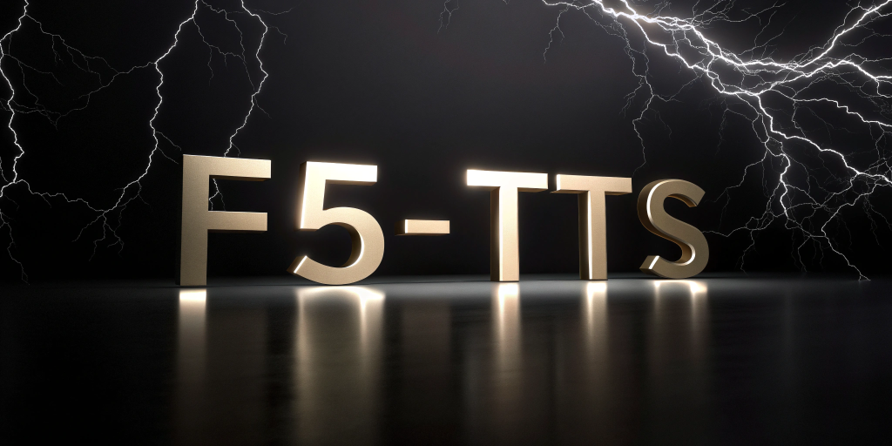

How small can a F5TTS model get? Very small!

Now you can generate synthetic voice using AI, with pretty high quality under very constrained hardware. In order to run F5-TTS quantized version you just need around ~400mb of VRAM. (Spoiler: mac only currently)



The entire model pipeline is including the below types of weights:
- F5-TTS weight (223 MB)
- Duration predictor (86.2 MB)
- Vocos (53.4 MB)
Total ~ **363 MB**

## How to install Quantized F5-TTS
I have quantized the model and made an all-in-one package for you to just directly install from pip:

```zsh
pip install f5-tts-mlx-quantized
```
[Github](https://github.com/tikikun/f5-tts-mlx-quantized)

This is a forked version of original f5-tts-mlx which I already refactored the model loading pipeline to directly load the quantized version of f5-tts instead of the full precision one.


## How much VRAM has been saved? 

Here is a Markdown table comparing the model sizes before and after quantization:

| Component | Original Size | Quantized Size |
| --- | --- | --- |
| F5-TTS Weight | 1.3 GB | 223 MB (4bit) |
| Duration Predictor | 86.2 MB | 86.2 MB |
| Vocos | 53.4 MB | 53.4 MB |
| **Total Size** | **1.4396 GB** | **362.6 MB** |
| **Compression Ratio** | - | ~ 4 times |

## How the quantization was done?
You can find the information about how quantization was done inside the code. To save you the effort I will just quote the important part here.
```python filename="cfm.py"
cfm.py
...
    @classmethod
    def from_pretrained(
        cls, hf_model_name_or_path: str, convert_weights=False, bit = None
    ) -> F5TTS:
        if bit is None:
            if "8bit" in hf_model_name_or_path:
                print("Loading model with 8bit quantization")
                bit = 8
            elif "4bit" in hf_model_name_or_path:
                print("Loading model with 4bit quantization")
                bit = 4
        path = fetch_from_hub(hf_model_name_or_path)

... 
        if bit is not None:
            nn.quantize(f5tts, bits = bit, class_predicate= lambda p, m: isinstance(m, nn.Linear) and m.weight.shape[1] % 64 == 0)
...
```

There is some strange part during quantization as you can see: `class_predicate= lambda p, m: isinstance(m, nn.Linear) and m.weight.shape[1] % 64 == 0)`. The purpose of the class predicate is to filter out layers that cannot be divided by 64 (which violate the group size needed for quantization in MLX). Since originally there is a layer in F5TTS that is not divisible by 64.

So the step is:
1. Load the model 
2. Make the filter condition for group size
3. Quantize the model
4. Extract the quantized model weight for later use.

## What can I do with Text-to-speech
A few things:
- Clone your own voice?
- Make an AI podcast? (like this [VoiceOver](https://github.com/tikikun/voiceover))
- Make a voice chatbot (like our paper [🍓Ichigo?](https://github.com/janhq/ichigo))

I have an example usage of the voiceover repo in my SubStack [link](https://neuronsquantized.substack.com/p/multi-modal-tokenizing-with-chameleon) to demonstrate the ability of the model to generate podcast/voiceover. The voice is pretty natural and does not have "robotic" feeling of the model that is at the same size.

Best part, you can do it on any Macbook, totally free. No need expensive Text-to-speech service online anymore.


## Appreciation

